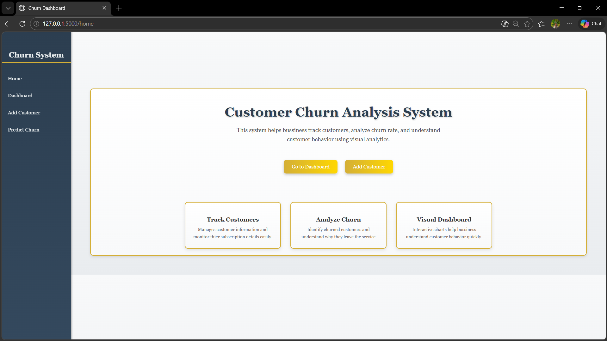
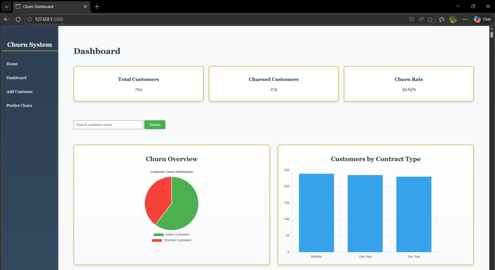
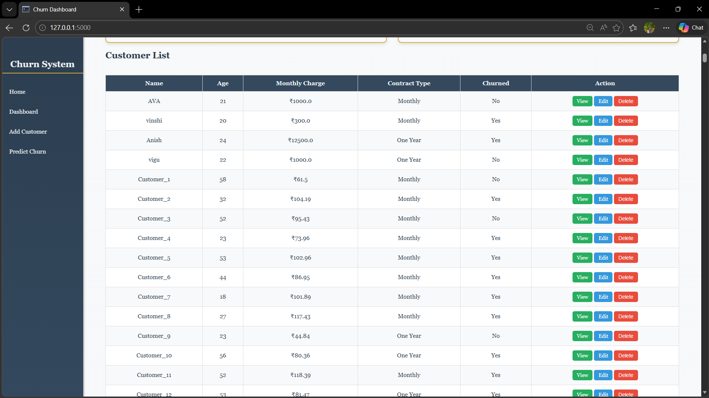
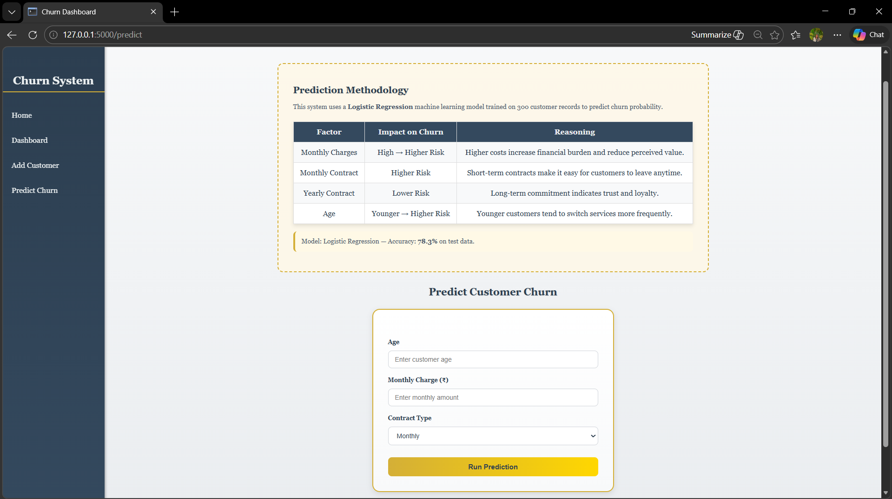
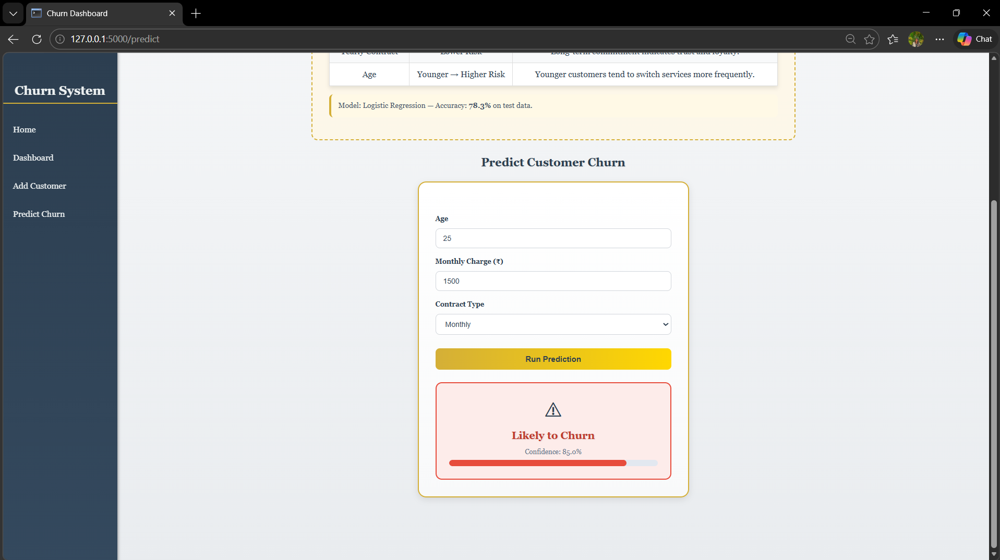

# Churn Dashboard

A customer churn analytics web application built with Flask and MySQL,
featuring a real Machine Learning model to predict customer churn probability.

## Screenshots

### Home Page


### Dashboard



### Churn Prediction



## Features

- Dashboard with live churn rate, total customers, and churned count
- Customer management — add, edit, delete, view customers
- Search customers by name
- Contract type breakdown chart
- Churn prediction using Logistic Regression (78.3% accuracy)
- Confidence percentage with visual progress bar

## Tech Stack

- **Backend:** Python, Flask
- **Database:** MySQL
- **Machine Learning:** scikit-learn (Logistic Regression)
- **Frontend:** HTML, CSS, JavaScript, Chart.js
- **Tools:** pandas, numpy, joblib

## ML Model

- Algorithm: Logistic Regression
- Training data: 300+ customer records
- Features: Age, Monthly Charge, Contract Type, Gender, Tenure, Payment Method
- Accuracy: 78.3% on test data

## Setup Instructions

1. Clone the repository
```bash
git clone https://github.com/VignuLogic/churn_dashboard.git
cd churn_dashboard
```

2. Install dependencies
```bash
pip install -r requirements.txt
```

3. Set up MySQL database and update `config.py` with your credentials

4. Train the ML model
```bash
python train_model.py
```

5. Run the app
```bash
python app.py
```

6. Open `http://localhost:5000` in your browser